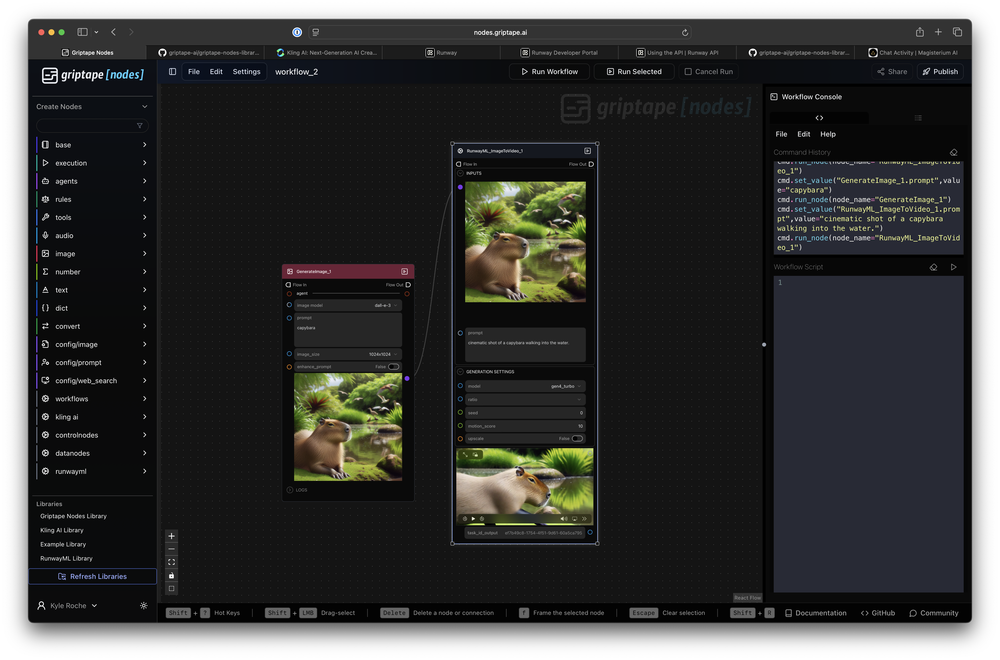
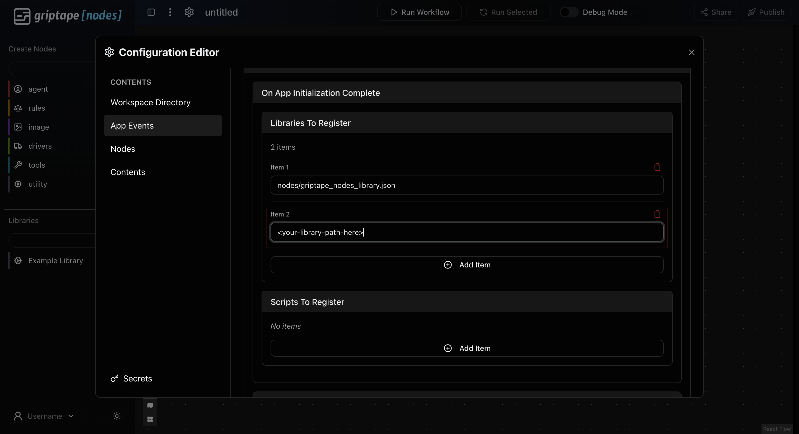
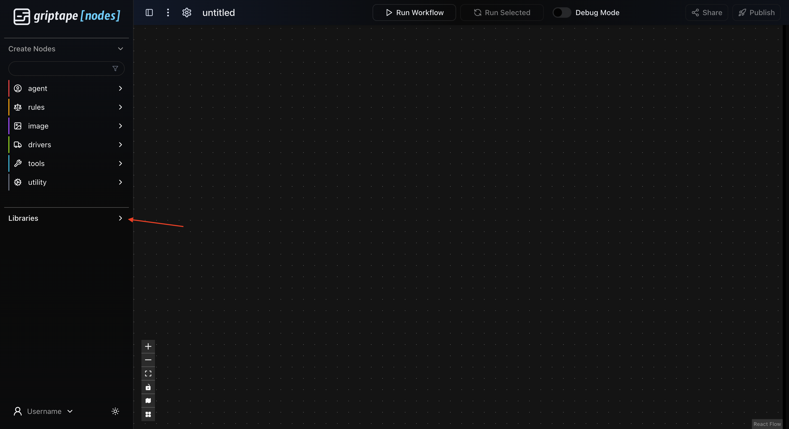

# RunwayML Video Nodes

This library provides Griptape Nodes for interacting with the RunwayML video generation services. You can use these nodes to generate videos from images and text prompts.

**IMPORTANT:** To use these nodes, you will need an API key from RunwayML. Please visit the [RunwayML website](https://runwayml.com/) and their [API documentation](https://docs.dev.runwayml.com/guides/using-the-api/) for more information on how to obtain your key.

To configure your key within the Griptape Nodes IDE:
1. Open the **Settings** menu.
2. Navigate to the **API Keys & Secrets** panel.
3. Add a new secret configuration for the service named `RunwayML`.
4. Enter your `RUNWAYML_API_SECRET` in the respective field.

Below is a description of the nodes included in this library and their parameters.

### RunwayML Image to Video (`RunwayML_ImageToVideo`)

Generates a video from a reference image and a text prompt using the RunwayML API.

| Parameter        | Type                          | Description                                                                                                                  | Default Value   |
|------------------|-------------------------------|------------------------------------------------------------------------------------------------------------------------------|-----------------|
| `image`          | `ImageArtifact` / `str`       | Input image (required). Accepts `ImageArtifact`, `ImageUrlArtifact`, a public HTTPS URL string, or a base64 data URI string. Local HTTP URLs will be converted to data URIs. |                 |
| `prompt`         | `str` / `TextArtifact`        | Text prompt describing the desired video content.                                                                            | `""`            |
| `model`          | `str`                         | RunwayML model to use for generation.                                                                                        | `gen4_turbo`    |
| `ratio`          | `str`                         | Aspect ratio for the output video. Must be one of the specific values supported by RunwayML API (e.g., "1280:720").         | `1280:720`      |
| `seed`           | `int`                         | Seed for generation. 0 for random. (Note: May not be supported by all models or the current API version for this endpoint). | `0`             |
| `video_output`   | `VideoUrlArtifact`            | **Output:** URL of the generated video.                                                                                      | `None`          |
| `task_id_output` | `str`                         | **Output:** The Task ID of the generation job from RunwayML.                                                                 | `None`          |

### RunwayML Text to Image

Generates an image from a text prompt and an optional list of reference images using the RunwayML API.

| Parameter          | Type                    | Description                                                                                                                  | Default Value   |
|--------------------|-------------------------|------------------------------------------------------------------------------------------------------------------------------|-----------------|
| `prompt_text`      | `str` / `TextArtifact`  | Text prompt describing the desired image.                                                                                    | `""`            |
| `reference_images` | `list`                  | An optional list of reference images. Click the `+` button to add reference images to the list.                              | `None`          |
| `model`            | `str`                   | RunwayML model to use for generation.                                                                                        | `gen4_image`    |
| `ratio`            | `str`                   | Aspect ratio for the output image. Must be one of the specific values supported by RunwayML API (e.g., "1280:720").          | `1024x1024`     |
| `seed`             | `int`                   | Seed for generation. 0 for random. (Note: May not be supported by all models or the current API version for this endpoint).  | `0`             |
| `image_output`     | `ImageUrlArtifact`      | **Output:** URL of the generated video.                                                                                      | `None`          |
| `task_id_output`   | `str`                   | **Output:** The Task ID of the generation job from RunwayML.                                                                 | `None`          |

### RunwayML Create Reference Image

Creates a `ReferenceImageArtifact` for use as an entry in the `reference_images` list in an instance of a RunwayML Text to Image node. Reference images can be used to combine different objects or characters into an image, and for image editing and style transfer use-cases.

| Parameter         | Type                                        | Description                                                                                              | Default Value   |
|-------------------|---------------------------------------------|----------------------------------------------------------------------------------------------------------|-----------------|
| `image`           | `ImageArtifact`, `ImageUrlArtifact`, `str`  | Text prompt describing the desired image.                                                                | `""`            |
| `tag    `         | `list`                                      | The tag to reference this image in prompts (e.g., 'EiffelTower'). Use @tag in your prompt.               | `None`          |
| `reference_image` | `ReferenceImageArtifact`                    | **Output:** `ReferenceImageArtifact` combining the image and tag. Connect to RunwayML Text to Image node | `None`          |

### RunwayML Character Performance (`RunwayML_CharacterPerformance`)

Generates a character performance video using RunwayML's Act Two API. This node allows you to animate a character (from an image or video) to perform actions based on a reference video.

| Parameter                | Type                                                                | Description                                                                                                                 | Default Value   |
|-------------------------|---------------------------------------------------------------------|-----------------------------------------------------------------------------------------------------------------------------|-----------------|
| `character_image`       | `ImageArtifact` / `ImageUrlArtifact` / `str`                        | [REQUIRED*] Input image of the character. Either character_image OR character_video must be provided. Accepts ImageArtifact, ImageUrlArtifact, a public URL string, or a base64 data URI string. | `None`          |
| `character_video`       | `VideoArtifact` / `UrlArtifact` / `VideoUrlArtifact` / `str`        | [REQUIRED*] Character video for the performance. Either character_image OR character_video must be provided. Accepts UrlArtifact, VideoUrlArtifact, a public URL string, or a base64 data URI string. | `None`          |
| `reference_video`       | `VideoArtifact` / `UrlArtifact` / `VideoUrlArtifact` / `str`        | [REQUIRED] Reference video for the character. Accepts UrlArtifact, VideoUrlArtifact, a public URL string, or a base64 data URI string. | `None`          |
| `body_control`          | `bool`                                                              | [REQUIRED] Whether to enable body control.                                                                                   | `True`          |
| `expression_intensity`  | `int`                                                               | [REQUIRED] Expression intensity (1-5).                                                                                       | `3`             |
| `ratio`                 | `str`                                                               | [REQUIRED] Aspect ratio for the output video. One of: "1280:720", "720:1280", "1104:832", "832:1104", "960:960", "1584:672"  | `1280:720`      |
| `seed`                  | `int`                                                               | [OPTIONAL] Seed for generation. 0 for random.                                                                                | `0`             |
| `model`                 | `str`                                                               | [REQUIRED] RunwayML model to use for generation.                                                                             | `act_two`       |
| `public_figure_threshold` | `str`                                                             | [OPTIONAL] Public figure threshold for content moderation. One of: "auto", "low"                                             | `auto`          |
| `video_output`          | `VideoUrlArtifact`                                                  | **Output:** URL of the generated video. Renders in the node as a video that you can play.                                    | `None`          |
| `task_id_output`        | `str`                                                               | **Output:** The Task ID of the generation job from RunwayML.                                                                 | `None`          |

## Add your library to your installed Engine! 

If you haven't already installed your Griptape Nodes engine, follow the installation steps [HERE](https://github.com/griptape-ai/griptape-nodes).
After you've completed those and you have your engine up and running: 

1. Copy the path to your `griptape_nodes_library.json` file within this `runwayml` directory. Right click on the file, and `Copy Path` (Not `Copy Relative Path`).
   
2. Start up the engine! 
3. Navigate to settings.
   
4. Open your settings and go to the App Events tab. Add an item in **Libraries to Register**.
   
5. Paste your copied `griptape_nodes_library.json` path from earlier into the new item.
   
6. Exit out of Settings. It will save automatically! 
7. Open up the **Libraries** dropdown on the left sidebar.
   
8. Your newly registered library should appear! Drag and drop nodes to use them!
    