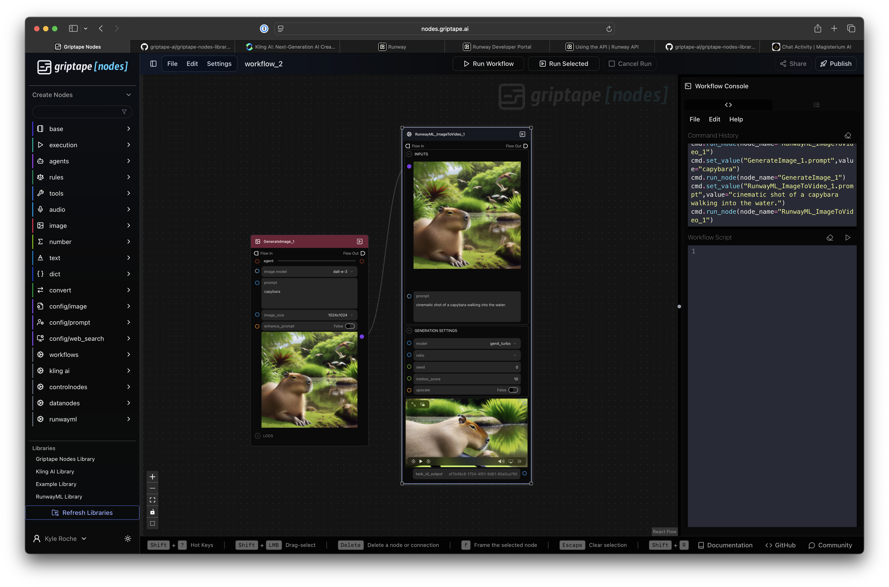
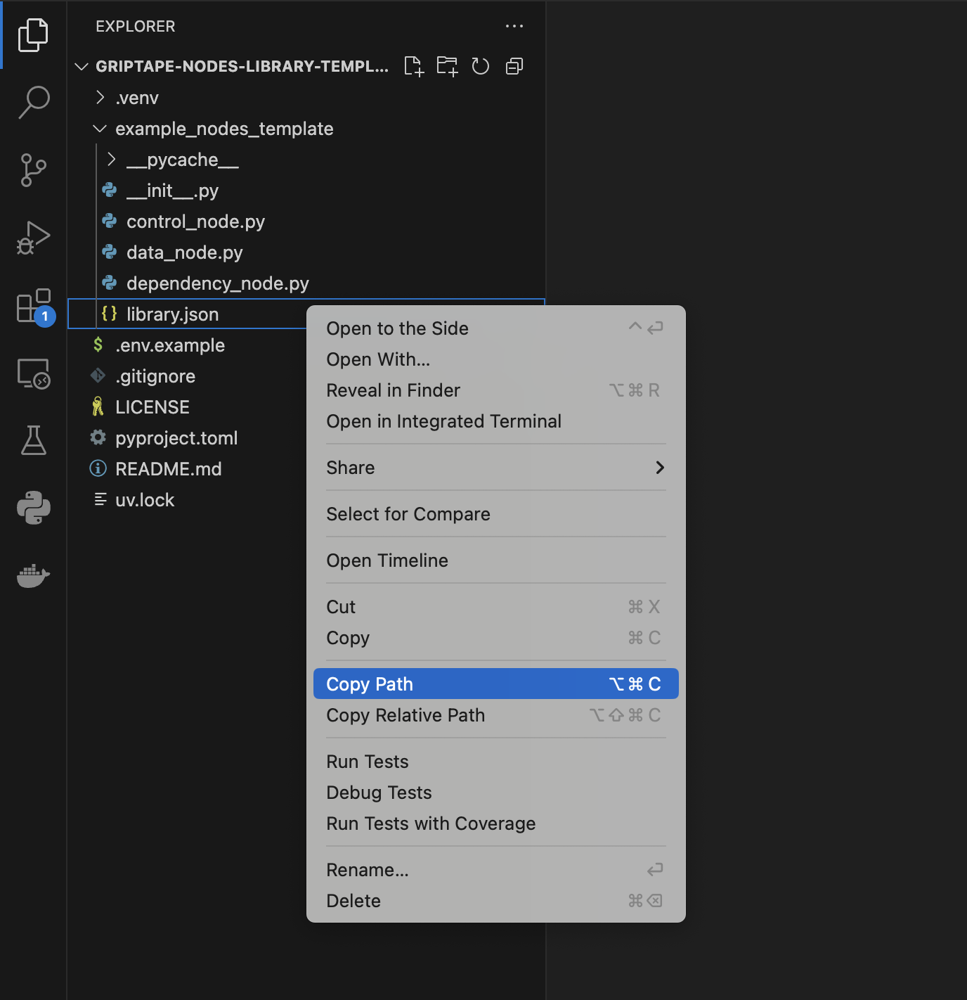
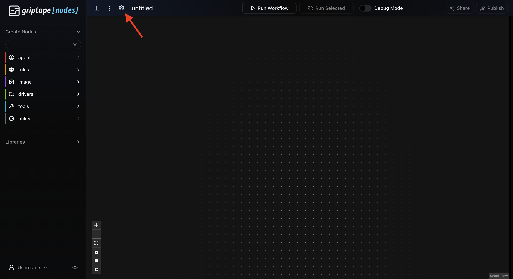
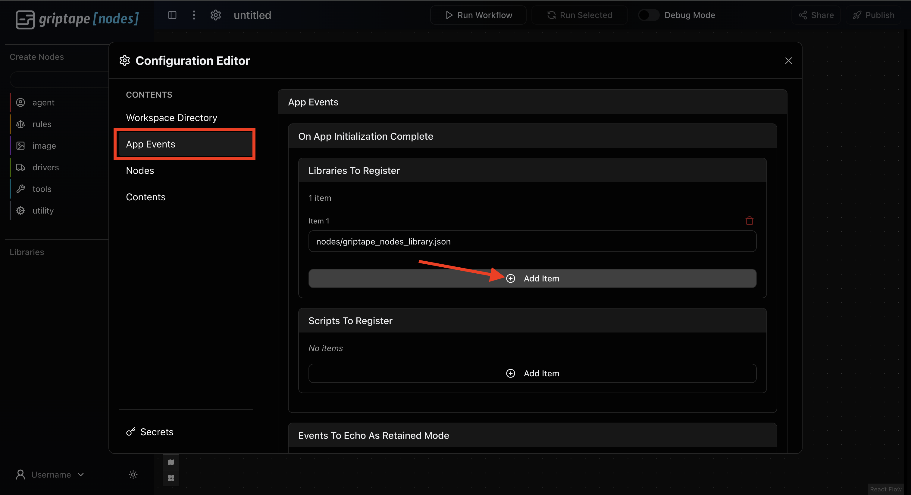
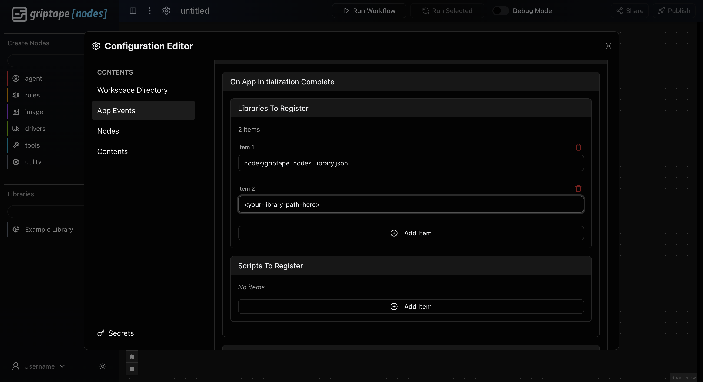
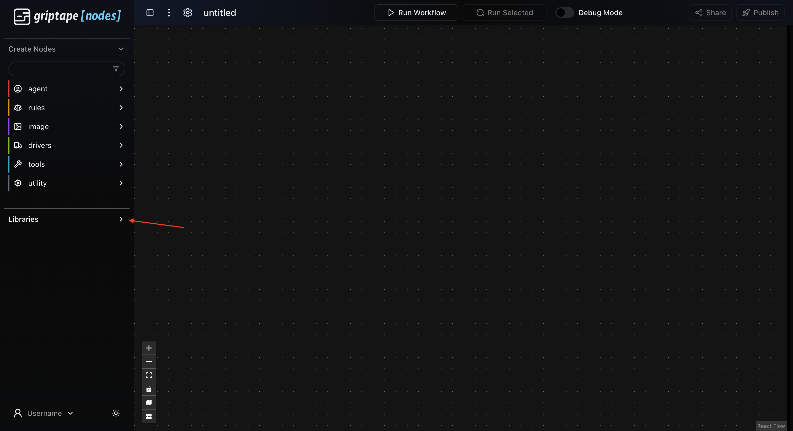
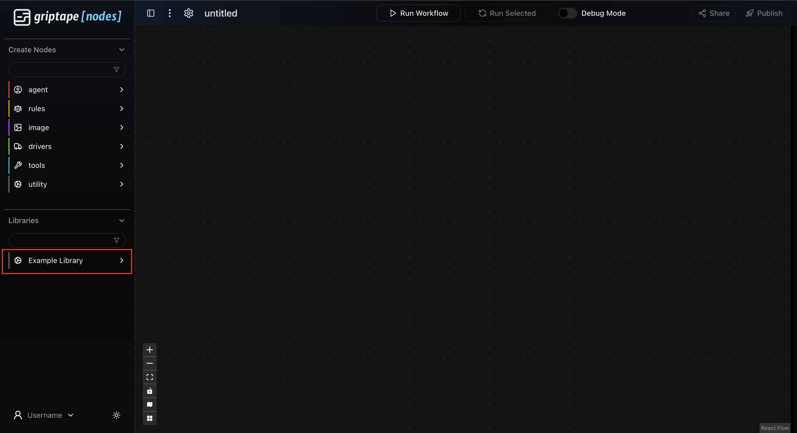

# RunwayML Video Nodes

This library provides Griptape Nodes for interacting with the RunwayML video generation services. You can use these nodes to generate videos from images and text prompts.

**IMPORTANT:** To use these nodes, you will need an API key from RunwayML. Please visit the [RunwayML website](https://runwayml.com/) and their [API documentation](https://docs.dev.runwayml.com/guides/using-the-api/) for more information on how to obtain your key.

To configure your key within the Griptape Nodes IDE:
1. Open the **Settings** menu.
2. Navigate to the **API Keys & Secrets** panel.
3. Add a new secret configuration for the service named `RunwayML`.
4. Enter your `RUNWAYML_API_SECRET` in the respective field.

## Retired models

RunwayML retired several model identifiers, and requests that use them now fail outright. If you
open a workflow saved against one of these, the model dropdown moves to the replacement below;
check the result before re-running, since pricing differs per model.

| Retired            | Replacement                        | Notes                                              |
|--------------------|------------------------------------|----------------------------------------------------|
| `gen3a_turbo`      | `gen4_turbo` (or `gen4.5`)         | Retired 2026-07-30. `gen4_turbo` is the closest match on speed and price; `gen4.5` is higher quality and costs more. |
| `gen4_aleph`       | `aleph2`                           | Retired 2026-07-30. `ratio` is replaced by `target_aspect_ratio`, and `prompt` is now optional. |
| `upscale_v1`       | `magnific_video_upscaler_creative` | Now the only model on the video upscale endpoint.  |

All three retirements are confirmed against the live API, which reports them explicitly —
`gen4_aleph` and `gen3a_turbo` return a sunset notice naming their replacement, and
`upscale_v1` reports "Model variant upscale_v1 is not available".

Run `make api/drift` to check this library's model lists against RunwayML's published API
spec, and `uv run python scripts/live_smoke.py` to check them against a live account.

## Success and failure outputs

Every generation node has two control outputs, **Succeeded** and **Failed**. On failure the
media output is left empty and the reason appears in the `result_details` output in the
node's Status group.

Connect **Failed** if you want to handle errors in the graph; leave it unconnected and a
failure stops the flow instead.

## Professional output formats

`Runway Text-to-Video`, `Runway Image-to-Video` (on `gen4.5`), `Runway Video-to-Video`, and
`Runway Video-to-HDR` can deliver more than H.264 mp4 via `output_format`: ProRes, 10-bit
Rec.709, HDR10, HLG, and 12-bit PQ mastering profiles. **RunwayML performs the encode
server-side and this library downloads the finished file** — nothing is transcoded locally.
Selecting a format updates the output filename's extension to match the container.

Anything other than mp4 carries a per-second credit surcharge, doubling above 4 megapixels.

RunwayML also offers frame-sequence deliveries (`png_sequence`, `hdr_exr_sequence`, and the
ACEScg EXR variants), which arrive as a zip of frames. Those are **not** offered yet: they
need unpacking into a `Sequence` to be usable by the OpenEXR and OpenColorIO nodes, which is
not implemented here.

Below is a description of the nodes included in this library and their parameters.

### RunwayML Image to Video (`RunwayML_ImageToVideo`)

Generates a video from a reference image and a text prompt using the RunwayML API.

| Parameter        | Type                          | Description                                                                                                                  | Default Value   |
|------------------|-------------------------------|------------------------------------------------------------------------------------------------------------------------------|-----------------|
| `image`          | `ImageArtifact` / `str`       | Input image (required). Accepts `ImageArtifact`, `ImageUrlArtifact`, a public HTTPS URL string, or a base64 data URI string. Local HTTP URLs will be converted to data URIs. |                 |
| `prompt`         | `str` / `TextArtifact`        | Text prompt describing the desired video content.                                                                            | `""`            |
| `model`          | `str`                         | RunwayML model to use for generation. One of: `gen4_turbo`, `gen4.5`.                                                        | `gen4_turbo`    |
| `ratio`          | `str`                         | Aspect ratio for the output video. Must be one of the specific values supported by RunwayML API (e.g., "1280:720").         | `1280:720`      |
| `seed`           | `int`                         | Seed for reproducible generation. Use `seed_control` to vary it between runs.                                                | `12345`         |
| `video_output`   | `VideoUrlArtifact`            | **Output:** URL of the generated video.                                                                                      | `None`          |
| `task_id_output` | `str`                         | **Output:** The Task ID of the generation job from RunwayML.                                                                 | `None`          |

### RunwayML Text to Video (`RunwayML_TextToVideo`)

Generates a video from a text prompt alone, with no starting image.

| Parameter          | Type                   | Description                                                                                  | Default Value |
|--------------------|------------------------|----------------------------------------------------------------------------------------------|---------------|
| `prompt`           | `str`                  | Text prompt describing the video to generate (max 1000 characters).                          | `""`          |
| `model`            | `str`                  | RunwayML model to use for generation.                                                        | `gen4.5`      |
| `ratio`            | `str`                  | Aspect ratio. One of: "1280:720", "720:1280".                                                | `1280:720`    |
| `duration`         | `int`                  | Duration in seconds (2-10). Billed per second.                                               | `5`           |
| `seed`             | `int`                  | Seed for reproducible generation.                                                            | `12345`       |
| `seed_control`     | `str`                  | fixed, increment, decrement, or randomize.                                                   | `randomize`   |
| `output_format`    | `str`                  | Delivery container. See **Professional output formats** above.                                | `mp4`         |
| `prores_profile`   | `str`                  | ProRes tier, used only when `output_format` is prores or hdr_prores.                          | `4444`        |
| `video_output`     | `VideoUrlArtifact`     | **Output:** The generated video, saved into project files.                                    | `None`        |
| `task_id_output`   | `str`                  | **Output:** The Task ID of the RunwayML job.                                                  | `None`        |

### RunwayML Video to HDR (`RunwayML_VideoToHDR`)

Upconverts an SDR video to true HDR with Ruby, RunwayML's HDR grading model. The output keeps
the source's own pixels — luma and colour are extended into the HDR range, nothing is
re-synthesized.

The input must be genuinely SDR (an HDR-tagged video is rejected), at most 30 seconds, and
under 4096px per side.

| Parameter          | Type                   | Description                                                                                  | Default Value |
|--------------------|------------------------|----------------------------------------------------------------------------------------------|---------------|
| `video`            | `VideoUrlArtifact`     | SDR video to convert.                                                                        | `None`        |
| `model`            | `str`                  | RunwayML model to use for HDR conversion.                                                    | `ruby`        |
| `output_format`    | `str`                  | Delivery profile. One of: "hdr10", "hlg", "hdr_prores".                                      | `hdr10`       |
| `prores_profile`   | `str`                  | ProRes tier, used only when `output_format` is hdr_prores. One of: "422", "422 HQ", "4444".   | `422 HQ`      |
| `video_output`     | `VideoUrlArtifact`     | **Output:** The HDR video, saved into project files.                                          | `None`        |
| `task_id_output`   | `str`                  | **Output:** The Task ID of the RunwayML job.                                                  | `None`        |

### RunwayML Text to Image

Generates an image from a text prompt and an optional list of reference images using the RunwayML API.

| Parameter          | Type                    | Description                                                                                                                  | Default Value   |
|--------------------|-------------------------|------------------------------------------------------------------------------------------------------------------------------|-----------------|
| `prompt_text`      | `str` / `TextArtifact`  | Text prompt describing the desired image.                                                                                    | `""`            |
| `reference_images` | `list`                  | Up to **3** tagged reference images. Click the `+` button to add reference images to the list.                               | `None`          |
| `model`            | `str`                   | RunwayML model to use. One of: `gen4_image`, `gen4_image_turbo` (turbo is cheaper but requires at least one reference image). | `gen4_image`    |
| `ratio`            | `str`                   | Aspect ratio for the output image. Must be one of the specific values supported by RunwayML API (e.g., "1280:720").          | `1024:1024`     |
| `seed`             | `int`                   | Seed for reproducible generation. Use `seed_control` to vary it between runs.                                                | `12345`         |
| `image_output`     | `ImageUrlArtifact`      | **Output:** URL of the generated video.                                                                                      | `None`          |
| `task_id_output`   | `str`                   | **Output:** The Task ID of the generation job from RunwayML.                                                                 | `None`          |

### RunwayML Create Reference Image

Creates a `ReferenceImageArtifact` for use as an entry in the `reference_images` list in an instance of a RunwayML Text to Image node. Reference images can be used to combine different objects or characters into an image, and for image editing and style transfer use-cases.

| Parameter         | Type                                        | Description                                                                                              | Default Value   |
|-------------------|---------------------------------------------|----------------------------------------------------------------------------------------------------------|-----------------|
| `image`           | `ImageArtifact`, `ImageUrlArtifact`, `str`  | Text prompt describing the desired image.                                                                | `""`            |
| `tag    `         | `list`                                      | The tag to reference this image in prompts (e.g., 'EiffelTower'). Use @tag in your prompt.               | `None`          |
| `reference_image` | `ReferenceImageArtifact`                    | **Output:** `ReferenceImageArtifact` combining the image and tag. Connect to RunwayML Text to Image node | `None`          |

### RunwayML Character Performance (`RunwayML_CharacterPerformance`)

Generates a character performance video using RunwayML's Act Two API. This node allows you to animate a character (from an image or video) to perform actions based on a reference video.

| Parameter                | Type                                                                | Description                                                                                                                 | Default Value   |
|-------------------------|---------------------------------------------------------------------|-----------------------------------------------------------------------------------------------------------------------------|-----------------|
| `character_image`       | `ImageArtifact` / `ImageUrlArtifact` / `str`                        | [REQUIRED*] Input image of the character. Either character_image OR character_video must be provided. Accepts ImageArtifact, ImageUrlArtifact, a public URL string, or a base64 data URI string. | `None`          |
| `character_video`       | `VideoArtifact` / `UrlArtifact` / `VideoUrlArtifact` / `str`        | [REQUIRED*] Character video for the performance. Either character_image OR character_video must be provided. Accepts UrlArtifact, VideoUrlArtifact, a public URL string, or a base64 data URI string. | `None`          |
| `reference_video`       | `VideoArtifact` / `UrlArtifact` / `VideoUrlArtifact` / `str`        | [REQUIRED] Reference video for the character. Accepts UrlArtifact, VideoUrlArtifact, a public URL string, or a base64 data URI string. | `None`          |
| `body_control`          | `bool`                                                              | [REQUIRED] Whether to enable body control.                                                                                   | `True`          |
| `expression_intensity`  | `int`                                                               | [REQUIRED] Expression intensity (1-5).                                                                                       | `3`             |
| `ratio`                 | `str`                                                               | [REQUIRED] Aspect ratio for the output video. One of: "1280:720", "720:1280", "1104:832", "832:1104", "960:960", "1584:672"  | `1280:720`      |
| `seed`                  | `int`                                                               | Seed for reproducible generation. Use `seed_control` to vary it between runs.                                                 | `12345`         |
| `model`                 | `str`                                                               | [REQUIRED] RunwayML model to use for generation.                                                                             | `act_two`       |
| `public_figure_threshold` | `str`                                                             | [OPTIONAL] Public figure threshold for content moderation. One of: "auto", "low"                                             | `auto`          |
| `video_output`          | `VideoUrlArtifact`                                                  | **Output:** URL of the generated video. Renders in the node as a video that you can play.                                    | `None`          |
| `task_id_output`        | `str`                                                               | **Output:** The Task ID of the generation job from RunwayML.                                                                 | `None`          |

### RunwayML Video to Video (`RunwayML_VideoToVideo`)

Generates a video from an input video and a text prompt using RunwayML's Video-to-Video API. We strongly recommend that you install ffmpeg in order to enable video transcoding features in this node.

The input video must be between 2 and 30 seconds long. `prompt` is optional: an edit can be driven by a guidance image or a target aspect ratio alone.

| Parameter                | Type                                                                | Description                                                                                                                 | Default Value   |
|-------------------------|---------------------------------------------------------------------|-----------------------------------------------------------------------------------------------------------------------------|-----------------|
| `video`                 | `VideoUrlArtifact` / `UrlArtifact` / `str`                          | Input video (required). Accepts VideoUrlArtifact, UrlArtifact, or a public URL string.                                       | `None`          |
| `prompt`                | `str` / `TextArtifact`                                              | Text prompt describing the desired video content.                                                                            | `""`            |
| `model`                 | `str`                                                               | RunwayML model to use for generation.                                                                                        | `aleph2`        |
| `target_aspect_ratio`   | `str`                                                               | Expand the frame to this aspect ratio, letterboxing the input so the model outpaints the new edges. One of: "Match input", "21:9", "16:9", "4:3", "3:2", "1:1", "2:3", "3:4", "9:16" | `Match input`   |
| `seed`                  | `int`                                                               | Seed for reproducible generation. Use `seed_control` to vary it between runs.                                                 | `12345`         |
| `reference_image`       | `ImageArtifact` / `ImageUrlArtifact` / `str`                        | Optional guidance image, applied at the start of the clip. JPEG, PNG, and WebP only.                                          | `None`          |
| `public_figure_threshold` | `str`                                                             | Public figure threshold for content moderation. One of: "auto", "low"                                                        | `auto`          |
| `video_output`          | `VideoUrlArtifact`                                                  | **Output:** URL of the generated video.                                                                                      | `None`          |
| `task_id_output`        | `str`                                                               | **Output:** The Task ID of the generation job from RunwayML.                                                                 | `None`          |

## RunwayML Video Upscale

Upscales a video using RunwayML's Magnific video upscaler. The input video must be 30 seconds or shorter.

| Parameter                | Type                                                                | Description                                                                                                                 | Default Value   |
|-------------------------|---------------------------------------------------------------------|-----------------------------------------------------------------------------------------------------------------------------|-----------------|
| `video`                 | `VideoUrlArtifact` / `UrlArtifact` / `str`                          | Input video (required). Accepts VideoUrlArtifact, UrlArtifact, or a public URL string.                                       | `None`          |
| `model`                 | `str`                                                               | RunwayML model to use for upscaling.                                                                                        | `magnific_video_upscaler_creative` |
| `resolution`            | `str`                                                               | Output resolution. One of: "720p", "1k", "2k", "4k". Billing is per output frame, so 4k costs considerably more than 720p.   | `2k`            |
| `flavor`                | `str`                                                               | Overall look. One of: "natural", "vivid".                                                                                    | `natural`       |
| `creativity`            | `int`                                                               | 0-100. How much detail the upscaler may invent.                                                                              | `0`             |
| `sharpen`               | `int`                                                               | 0-100. Edge sharpening applied to the upscaled frames.                                                                       | `0`             |
| `smart_grain`           | `int`                                                               | 0-100. Film grain added after upscaling.                                                                                     | `0`             |
| `fps_boost`             | `bool`                                                              | Interpolate additional frames to raise the output frame rate.                                                                | `False`         |
| `video_output`          | `VideoUrlArtifact`                                                  | **Output:** URL of the upscaled video.                                                                                       | `None`          |
| `task_id_output`        | `str`                                                               | **Output:** The Task ID of the RunwayML job.                                                                                 | `None`          |

## Add your library to your installed Engine! 

If you haven't already installed your Griptape Nodes engine, follow the installation steps [HERE](https://github.com/griptape-ai/griptape-nodes).
After you've completed those and you have your engine up and running: 

1. Copy the path to your `griptape_nodes_library.json` file within this `runwayml` directory. Right click on the file, and `Copy Path` (Not `Copy Relative Path`).
   
2. Start up the engine! 
3. Navigate to settings.
   
4. Open your settings and go to the App Events tab. Add an item in **Libraries to Register**.
   
5. Paste your copied `griptape_nodes_library.json` path from earlier into the new item.
   
6. Exit out of Settings. It will save automatically! 
7. Open up the **Libraries** dropdown on the left sidebar.
   
8. Your newly registered library should appear! Drag and drop nodes to use them!
    